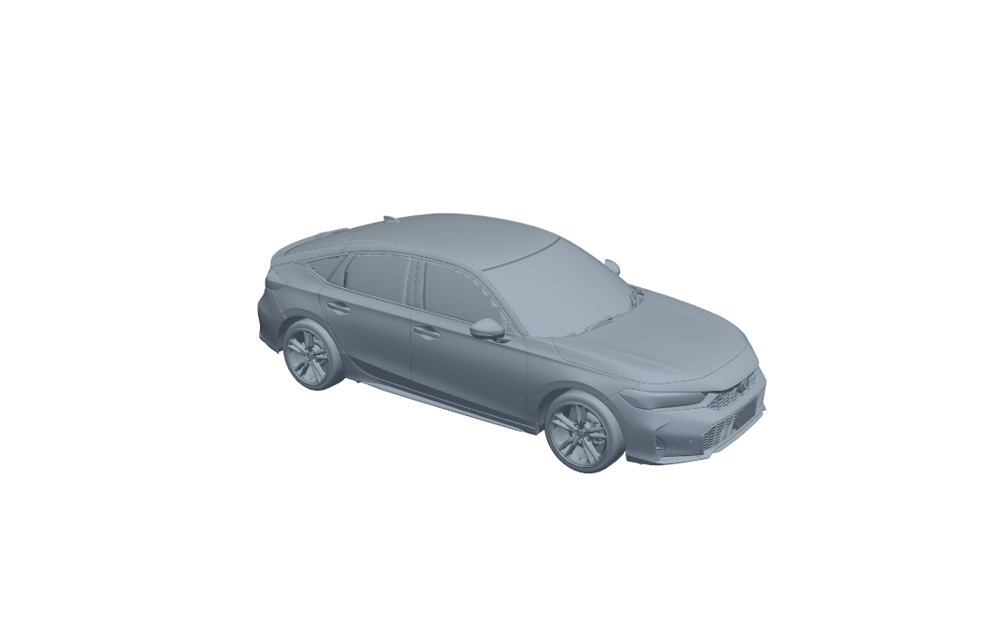

# Sculp-Scanner

Chrome で開いた **PlayCanvas 製の 360°ビュー（コンフィギュレータ）** から、
いま画面に表示されている車両の 3D データを取り出して **STL** として保存するアプリです。
**Honda・Toyota・Hyundai（Casper）** の 360°ビューで動作確認済みです（いずれも PlayCanvas 製のため無改造で対応）。

> 詳細な操作手順と内部仕様は **[SPEC.md](SPEC.md)** にまとめています。



## しくみ

Honda の 360°ビュー（`https://www.honda.co.jp/*/configurator/`）や
Toyota の 360°ビュー（`https://toyota.jp/*/configurator/`、実体は iframe 内の PlayCanvas ページ）は、
連番画像を切り替える方式ではなく **PlayCanvas（WebGL）で動く本物の 3D アプリ**です。
本アプリは iframe の中も探索するため、どちらも同じ手順でそのまま使えます。

Sculp-Scanner は Chrome DevTools Protocol でそのページに入り込み、
**稼働中の PlayCanvas シーングラフから直接メッシュを読み出します。**

```
Chrome (PlayCanvas)                    Sculp-Scanner
  app.root を走査
  ├ render.meshInstances[]  ──読み出し──▶ 頂点 / インデックス / ワールド行列
  │                                          │
  └ 背景・壁・床は自動で除外                  ▼
                                        numpy で三角形に展開
                                        Y-up → Z-up、m → mm へ変換
                                        VTK で頂点溶接・任意で間引き
                                             │
                                             ▼
                                        binary STL
```

ブラウザ上では Draco 圧縮された GLB が既に展開済みなので、そのまま正確な形状が得られます。
また **いま表示中のグレード・オプション・ホイールの構成がそのまま反映されます**
（画面で色やグレードを切り替えてからスキャンし直せば、その構成で出力されます）。

## 必要なもの

Python 3.12 以降と以下のパッケージ。**この PC では既に全て導入済みです。**

```
playwright  numpy  pyvista  vtk  PySide6
```

初回のみブラウザ本体が必要です（導入済みでなければ）:

```
python -m playwright install chromium
```

## 使い方（GUI）

```
python -m sculpscanner
```

1. URL 欄に 360°ビューのページを入れる（既定はシビック）
2. **［Chrome を起動］** … デバッグポート付きの Chrome が専用プロファイルで開きます
   （既に開いている通常の Chrome には後からデバッグポートを開けません。
   自分で車種・色・グレードを選びたい場合はこの Chrome 上で操作してください）
   ※ この手順を飛ばした場合は、［接続してスキャン］時に Playwright 同梱の
   Chromium が自動で起動して URL を開きます
3. 360°ビューの読み込みが終わったら **［接続してスキャン］**
4. 左のツリーで出力したいパーツを選ぶ（背景・壁・床・影は自動でオフ）
5. **［STL を作成］** → 右にプレビュー、下に寸法が出ます
6. **［STL を保存...］**

単位・上方向・間引き率を変えたときは **［設定を反映して再構築］** を押します。

## 使い方（CLI）

```powershell
# 自前で Chromium を起動して抽出
python -m sculpscanner.cli "https://www.honda.co.jp/CIVIC/configurator/" -o out\civic.stl

# 既に launch_chrome_debug.bat で開いてある Chrome から抽出
python -m sculpscanner.cli --no-launch -o out\vezel.stl

# パート一覧を見るだけ
python -m sculpscanner.cli "https://www.honda.co.jp/FREED/configurator/" --list

# Toyota も同じ手順で使える（例: RAV4）
python -m sculpscanner.cli "https://toyota.jp/rav4/configurator/" -o out\rav4.stl

# Hyundai（韓国限定の Casper サブブランド）も同じ手順で使える
python -m sculpscanner.cli "https://casper.hyundai.com/vehicles/making/model" -o out\casper.stl
```

## 動作確認済みリンク集

対応可能と確認できた 360°ビュー／コンフィギュレータの URL。

| メーカー | 車種 | URL |
|---|---|---|
| Honda | CIVIC | https://www.honda.co.jp/CIVIC/configurator/ |
| Honda | VEZEL | https://www.honda.co.jp/VEZEL/configurator/ |
| Honda | FREED | https://www.honda.co.jp/FREED/configurator/ |
| Toyota | RAV4 | https://toyota.jp/rav4/configurator/ |
| Hyundai（Casper サブブランド、韓国限定） | CASPER | https://casper.hyundai.com/vehicles/making/model |

- Toyota・Hyundai は実体が iframe 内の PlayCanvas ページだが、本アプリは全フレームを探索するため
  上記の親ページ URL をそのまま渡せば動作する
- Hyundai Casper は韓国語 UI・韓国国内限定のオンライン専売 EV サブブランドのサイト
  （`hyundai.com` の通常のグローバル向けコンフィギュレータとは別物）

| オプション | 説明 |
|---|---|
| `-o, --output` | 出力する STL のパス |
| `--no-attach` | 既存 Chrome を探さず必ず新規起動する |
| `--no-launch` | 既存 Chrome が無ければ失敗させる |
| `--scale` | シーン単位への倍率（既定 1000 = m→mm）。1/24 なら `41.667` |
| `--up` | `Z`（既定・3D プリント向け）/ `Y`（PlayCanvas のまま） |
| `--decimate` | 0.0〜0.95 の間引き率 |
| `--no-weld` | 頂点の溶接をしない |
| `--include-background` | 背景・壁・床も出力に含める |
| `--cache FILE` | 抽出結果を npz に保存／再利用（設定違いの出力を試すとき用） |

## 対応メーカー

| メーカー | 対応状況 |
|---|---|
| Honda | ✅ 動作確認済み |
| Toyota | ✅ 動作確認済み（iframe 内の PlayCanvas ページを自動で見つける） |
| Hyundai（Casper サブブランド） | ✅ 動作確認済み（同じく iframe 内の PlayCanvas ページ。韓国限定サブブランドのみ確認） |
| Lexus | ❌ Toyota 系列だが別実装（`spritespin.min.js` による連番写真方式）のため対応不可 |
| Nissan / Mazda / Daihatsu / Suzuki / Mitsubishi | ❌ 連番写真の切り替え方式で 3D メッシュが存在しないため対応不可（実機で確認済み。Suzuki は JS バンドルに Three.js のクラス名が含まれるが、実際の 360 ビューは `` の連番写真切り替えのみで WebGL は未使用） |
| Subaru | ❌ 独自 WebGL 実装（PlayCanvas/Three.js/Babylon.js のいずれでもない）のため未対応 |
| BMW / Audi / Porsche / VW / JLR 等の欧州高級車 | ❌ ZeroLight 社によるクラウドレンダリング（サーバー側で描画した映像をストリーミング）が主流で、クライアント側 WebGL シーングラフではないため対応不可 |

## 動作確認済み

| メーカー | 車種 | パート | 三角形 | 出力寸法 (mm) | 実車諸元 (mm) |
|---|---|---|---|---|---|
| Honda | CIVIC | 307 | 323,587 | 4568.9 × 2080.5 × 1423.7 | 4550 × 1800 × 1415 |
| Honda | VEZEL | 152 | 2,096,496 | 4387.9 × 2050.1 × 1582.4 | 4330 × 1790 × 1580 |
| Toyota | RAV4 | 2,183 | 2,455,060 | 未計測（`--list` のみで確認） | — |
| Hyundai | CASPER | 1,424 | 2,366,456 | 未計測（`--list` のみで確認） | — |

幅が実車諸元より広いのは**ドアミラーを含む全幅**のためです。全長・全高は実車とほぼ一致します。

## 注意

- **水密（manifold）ではありません。** 車両モデルは板状のパーツの集合体なので、
  そのまま 3D プリントする場合は Meshmixer / Blender / PrusaSlicer 等での修復が必要です。
  形状の確認・CG 用途ならそのまま使えます。
- 出力される形状は **Honda の著作物**です。個人的な検証・学習用途に留めてください。
  再配布や商用利用はしないでください。
- ページ側の実装が変わると抽出できなくなる可能性があります。
  その場合は `sculpscanner/extract_js.py` の想定構造コメントを手掛かりに調整してください。
- **既定の除外パターンがメーカーによっては誤検知することがあります。**
  例: Hyundai Casper はインテリアのフロアマットパーツを `I_FLOOR/...` と命名しているため、
  背景の床面除外用パターン（`floor`）に巻き込まれて誤って除外される。
  GUI ならツリーで該当パーツを手動チェックすれば救済できるが、
  CLI では `--include-background` を使うか `extract_js.py` の `DEFAULT_EXCLUDE_PATTERN` を調整する必要がある。

## ファイル構成

| ファイル | 役割 |
|---|---|
| `sculpscanner/browser.py` | Chrome への接続、準備待ち、パート取得 |
| `sculpscanner/extract_js.py` | ページに注入するシーングラフ走査 JS |
| `sculpscanner/meshdata.py` | 三角形の組み立て・座標変換・STL 出力・キャッシュ |
| `sculpscanner/chrome.py` | デバッグポート付き Chrome の起動 |
| `sculpscanner/worker.py` | GUI 用のワーカースレッド |
| `sculpscanner/preview.py` | VTK による 3D プレビュー |
| `sculpscanner/gui.py` | PySide6 の画面 |
| `sculpscanner/cli.py` | コマンドライン |
